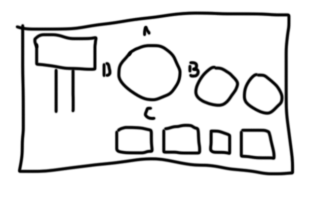

# Panel

A LEGO® control panel to provide physical controls to the BrickMMO Smart City. 



Control panel will not control anything directly. It will set a series of variables and make those values available to other BrickMMO applications. API export will include the following structure:

```json
{
	"master": "on",
	"mode": "a",
	"data": {
		"a": {
			"leftDial": "0",
			"rightDial": "360",
			"buttonA": "on",
			"buttonB": "on",
			"buttonC": "off",
			"buttonD": "off"
		},
		"b": {
			"leftDial": "0",
			"rightDial": "360",
			"buttonA": "on",
			"buttonB": "on",
			"buttonC": "off",
			"buttonD": "off"
		},
		"c": {
			"leftDial": "0",
			"rightDial": "360",
			"buttonA": "on",
			"buttonB": "on",
			"buttonC": "off",
			"buttonD": "off"
		},
		"d": {
			"leftDial": "0",
			"rightDial": "360",
			"buttonA": "on",
			"buttonB": "on",
			"buttonC": "off",
			"buttonD": "off"
		}
	}
}
```

> **Note**  
> JSON formating should follow the [Google JSON Style Guide](https://google.github.io/styleguide/jsoncstyleguide.xml).

***

## Repo Resources

* [BrickMMO](https://www.brickmmo.com/)
* [BrickMMO Panel](https://panel.brickmmo.com/)

<a href="https://brickmmo.com">

</a>
